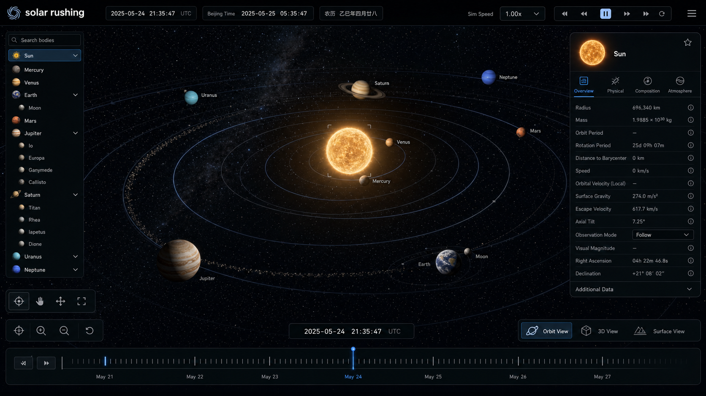
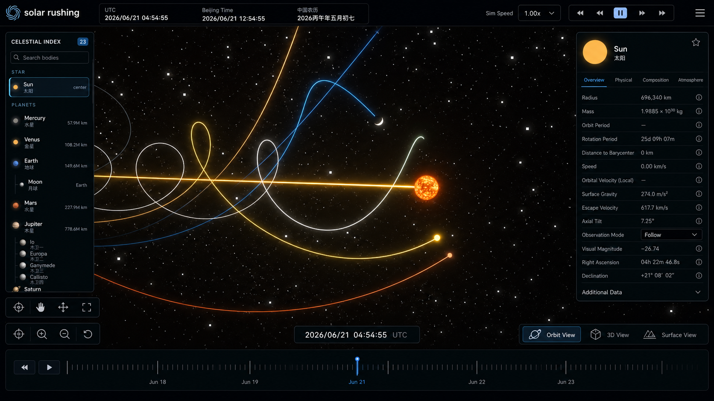
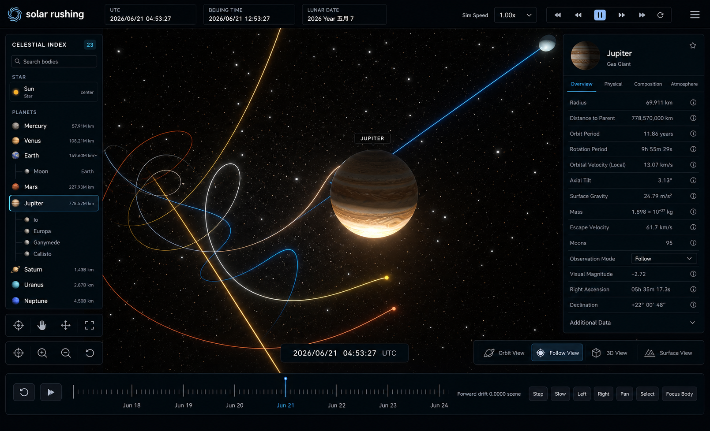
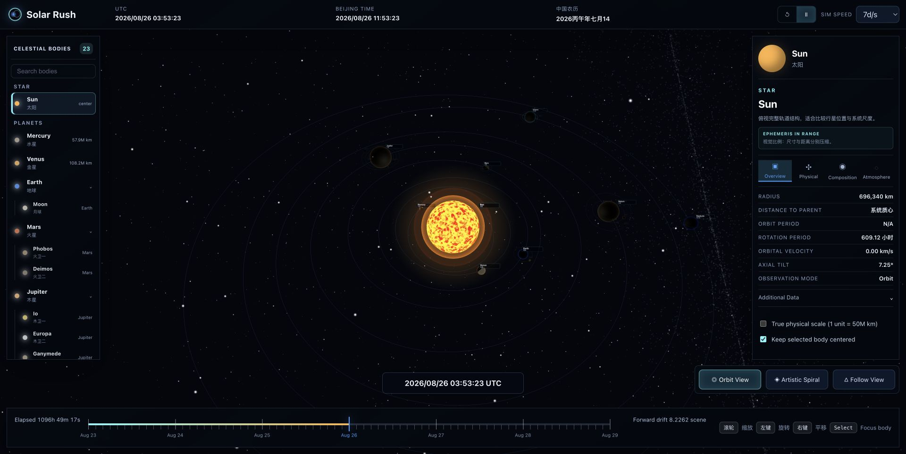
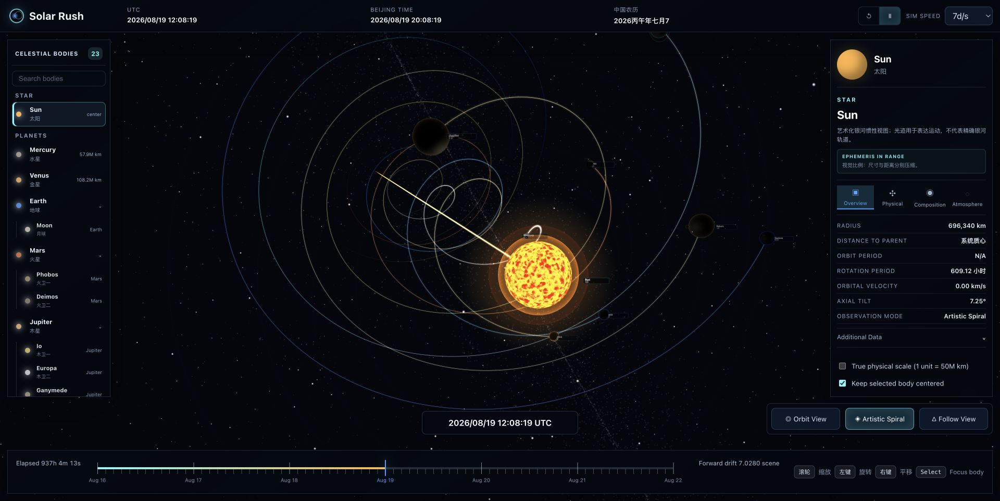
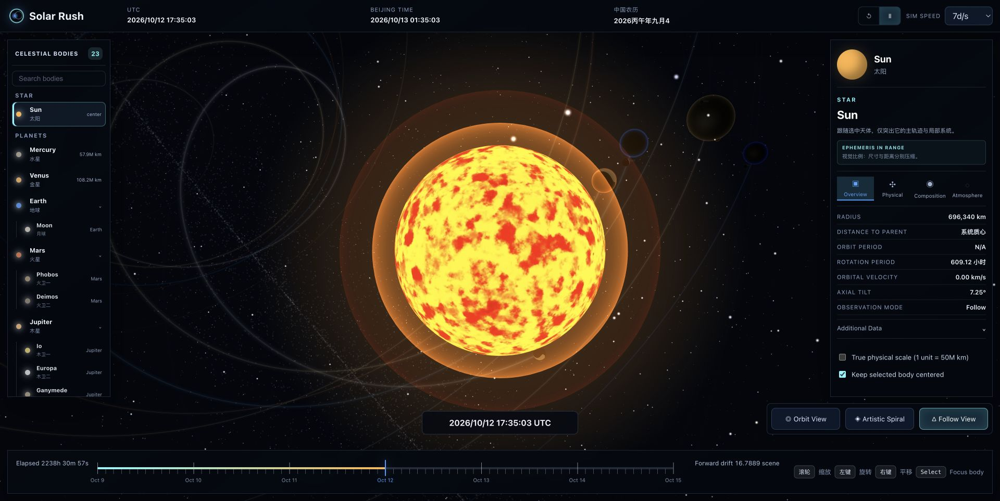

# Solar Rush

[English](README.md) | [简体中文](README.zh-CN.md)

An interactive, browser-based Solar System viewer and time simulator. Built with React and Three.js, Solar Rush brings planets, moons, orbital motion, time controls, and celestial data together in a single 3D scene.

[Live Demo](https://rayshen.github.io/solar-rush/)

## Vision

Solar Rush began with a simple ambition: to observe the Solar System from a god's-eye view—presenting celestial bodies, orbits, and the passage of time as faithfully as possible while preserving the scale, order, and mystery that make the cosmos so captivating.

It is more than a celestial data viewer. It aims to be a window through which anyone can freely contemplate the Solar System.

## Features

- Explore the Sun, all eight planets, and major moons through a searchable celestial index.
- Calculate celestial positions from orbital parameters with continuous time progression and multiple simulation speeds.
- Switch between `Orbit View`, `Artistic Spiral`, and `Follow View`.
- Rotate, zoom, pan, select celestial bodies, and keep the selected target centered.
- Inspect radius, orbital and rotation periods, gravity, escape velocity, and other celestial data.
- View synchronized UTC, Beijing time, and the Chinese lunar calendar.
- Experience real celestial textures, a star field, orbital paths, and motion trails that enhance spatial depth.

## Visual Concepts

The design combines the information density of professional astronomy software with an immersive space experience. Celestial navigation sits on the left, the central area is reserved for 3D observation, details about the selected body appear on the right, and time controls occupy the top and bottom edges.

### Orbit View

Centers the complete Solar System structure, emphasizing relative planetary positions, orbital hierarchy, and overall spatial relationships for global observation and navigation.



### Artistic Spiral

Uses motion trails and depth to express the Solar System's forward movement while retaining celestial information and strengthening the sense of speed and immersion.



### Follow View

Focuses on the selected body and its local system, reducing unrelated orbital noise to reveal moon relationships, motion paths, and celestial details.



## Current Implementation

The screenshots below were captured from the current development version of all three observation modes.

### Orbit View



### Artistic Spiral



### Follow View



## Tech Stack

- React 19
- Three.js
- Vite 7
- GitHub Actions / GitHub Pages

## Local Development

```bash
npm install
npm run dev
```

Production build:

```bash
npm run build
npm run preview
```

## Deployment

The project is deployed automatically through [GitHub Actions](.github/workflows/deploy-pages.yml). Every push to `master` installs dependencies, creates a production build, and publishes the `dist` directory to GitHub Pages.

## Data and Asset Notes

Orbital and celestial data are used for interactive visualization. Some views are artistic interpretations and should not replace professional astronomical calculations. Texture sources and licensing details are documented in [ATTRIBUTION.md](public/textures/ATTRIBUTION.md).
