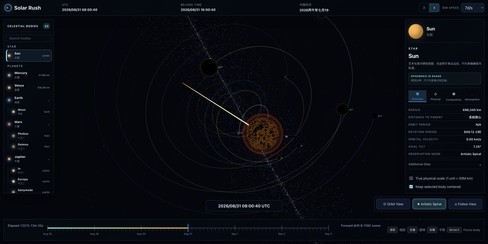

# Solar Rush

一个运行在浏览器中的交互式太阳系观测与时间模拟器。项目以 React 和 Three.js 构建，将行星、卫星、轨道、时间推进与天体信息面板整合在同一个 3D 场景中。

[在线体验](https://rayshen.github.io/solar-rush/)

## 当前能力

- 展示太阳、八大行星及主要卫星，并提供可搜索的天体索引。
- 基于轨道参数计算天体位置，支持连续时间推进和多档模拟速度。
- 提供 `Orbit View`、`Artistic Spiral` 和 `Follow View` 三种观察模式。
- 支持旋转、缩放、平移、天体选择与选中目标跟随。
- 展示半径、轨道周期、转动周期、重力、逃逸速度等天体数据。
- 同步显示 UTC、北京时间和中国农历日期。
- 使用真实天体纹理、星空背景、轨道与运动光迹增强空间层次。

## 视觉稿

设计目标是把专业天文软件的信息密度，与具有沉浸感的太空视觉体验结合起来：左侧负责天体导航，中间保留最大的 3D 观测区域，右侧呈现选中天体信息，顶部和底部承载时间控制。

### Orbit View

以完整太阳系结构为核心，强调行星相对位置、轨道层级和整体空间关系，适合全局观察与天体导航。


### Artistic Spiral

用运动光迹和纵深构图表达太阳系前进过程，在保留天体信息面板的同时强化速度感与沉浸感。


### Follow View

聚焦选中的天体及其局部系统，降低无关轨道的视觉干扰，便于查看卫星关系、运动轨迹和天体细节。


## 当前实现

下面的截图来自当前部署在 GitHub Pages 上的版本。



## 技术栈

- React 19
- Three.js
- Vite 7
- GitHub Actions / GitHub Pages

## 本地运行

```bash
npm install
npm run dev
```

生产构建：

```bash
npm run build
npm run preview
```

## 部署

项目通过 [GitHub Actions](.github/workflows/deploy-pages.yml) 自动部署。推送到 `master` 分支后，工作流会执行依赖安装、生产构建并发布 `dist` 目录到 GitHub Pages。

## 数据与素材说明

轨道与天体数据用于交互式可视化；部分视图为艺术化表达，不应替代专业天文计算结果。纹理素材的来源和授权信息见 [ATTRIBUTION.md](public/textures/ATTRIBUTION.md)。
