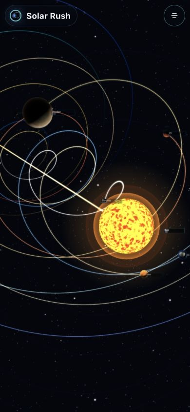

# Solar Rush

[English](README.md) | [简体中文](README.zh-CN.md)

An interactive, browser-based Solar System viewer and time simulator. Built with React and Three.js, Solar Rush combines ephemeris-driven planet positions, moons, orbital motion, time controls, celestial data, and a responsive 3D interface in a single scene.

[Live Demo](https://rayshen.github.io/solar-rush/)

## Vision

Solar Rush began with a simple ambition: to observe the Solar System from a god's-eye view—presenting celestial bodies, orbits, and the passage of time as faithfully as possible while preserving the scale, order, and mystery that make the cosmos so captivating.

It is more than a celestial data viewer. It aims to be a window through which anyone can freely contemplate the Solar System.

## Features

- Explore the Sun, all eight planets, and major moons through a searchable celestial index.
- Calculate heliocentric positions for all eight planets with Astronomy Engine's VSOP87/NOVAS-based ephemeris, with continuous time progression and multiple simulation speeds.
- Switch between `Orbit View`, `Artistic Spiral`, and `Follow View`.
- Rotate, zoom, pan, select celestial bodies, and keep the selected target centered.
- Inspect radius, orbital and rotation periods, gravity, escape velocity, and other celestial data.
- View synchronized UTC, Beijing time, and the Chinese lunar calendar.
- Experience real celestial textures, a J2000-aligned procedural Milky Way with a galactic bulge and dust lane, catalogue stars, orbital paths, and motion trails.
- Use a mobile-first interface with an immersive floating header, collapsible controls, touch-friendly celestial navigation, and scrollable detail panels.

## Visual Concepts

The desktop design combines the information density of professional astronomy software with an immersive space experience. Celestial navigation sits on the left, the central area is reserved for 3D observation, details about the selected body appear on the right, and time controls occupy the top and bottom edges. On mobile, the scene remains unobstructed behind a compact floating header, while view controls, celestial navigation, details, and the timeline live in a scrollable menu.

### Orbit View

Centers the complete Solar System structure, emphasizing relative planetary positions, orbital hierarchy, and overall spatial relationships for global observation and navigation.


### Artistic Spiral

Uses the present Solar Galactocentric velocity direction transformed into the J2000 ecliptic frame. Motion trails retain the measured orientation while compressing distance and pitch for legibility and immersion.


### Follow View

Focuses on the selected body and its local system, reducing unrelated orbital noise to reveal moon relationships, motion paths, and celestial details.


## Current Implementation

The screenshots below were captured from the current development version of all three observation modes.

### Orbit View


### Artistic Spiral


### Follow View


### Mobile View

The mobile layout keeps the 3D scene dominant and moves dense controls into an expandable, touch-friendly menu.



## Scientific Model and Scale

- Planet positions use [Astronomy Engine](https://github.com/cosinekitty/astronomy) heliocentric state vectors in the J2000 equatorial frame, transformed into the scene's J2000 ecliptic frame. Each Artistic Spiral trail derives its instantaneous orbital plane from the planet's position and velocity angular-momentum vector, preserving its inclination and ascending-node orientation.
- Major moon positions use compact J2000 mean-element propagation; they are visual approximations rather than Horizons/SPICE-grade satellite ephemerides.
- The Milky Way is procedural rather than photographic, but its conventional Galactic plane and Hipparcos stars are transformed from Galactic/ICRS coordinates through J2000 equatorial coordinates into the same J2000 ecliptic scene frame used by the planets. This preserves the approximately `60.19°` Galactic-plane/ecliptic-plane angle. The physical dynamical-center anchor uses the observed Sgr A* position (`λ 266.8517°`, `β −5.6077°`) rather than treating the historical Galactic-coordinate origin as identical to Sgr A*. Density, bulge width, star clouds, and the central dust lane remain visual models.
- The face-on Galaxy subview uses ESA/Gaia's data-informed artist impression. Its Sun marker is calibrated to the annotated 8.2 kpc position; other structure labels are approximate anchors copied from the annotated model view, not measured boundaries. This is neither a photograph nor a full 3D stellar-density map.
- Visual mode compresses body sizes and orbital distances independently for readability. Physical mode uses one unified scale: one scene unit equals 50 million kilometres.
- `Artistic Spiral` uses a present-day Solar Galactocentric velocity model `(U, V, W) = (9.5, 250.7, 8.56) km/s`, transformed to J2000 ecliptic longitude `342.2°` and latitude `61.0°`. The orientation is data-based; trail distance and pitch remain visually compressed and are not a scale model of the full Galactic orbit.

## Tech Stack

- React 19
- Three.js
- Astronomy Engine 2
- Vite 7
- GitHub Actions / GitHub Pages

## Local Development

```bash
npm install
npm run dev
```

Production build:

```bash
npm run build
npm run preview
```

## Deployment

The project is deployed automatically through [GitHub Actions](.github/workflows/deploy-pages.yml). Every push to `master` installs dependencies, creates a production build, and publishes the `dist` directory to GitHub Pages.

## Data and Asset Notes

Planet positions are suitable for interactive visualization, not spacecraft navigation or professional observation planning. Moon propagation, visual scale compression, the procedural Milky Way, the face-on Galaxy reconstruction, and motion trails remain approximations or artistic interpretations. Texture sources and licensing details are documented in [ATTRIBUTION.md](public/textures/ATTRIBUTION.md).
